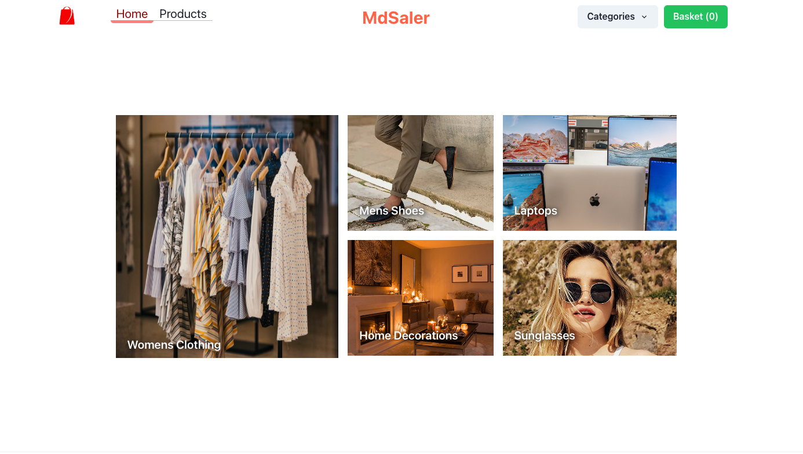
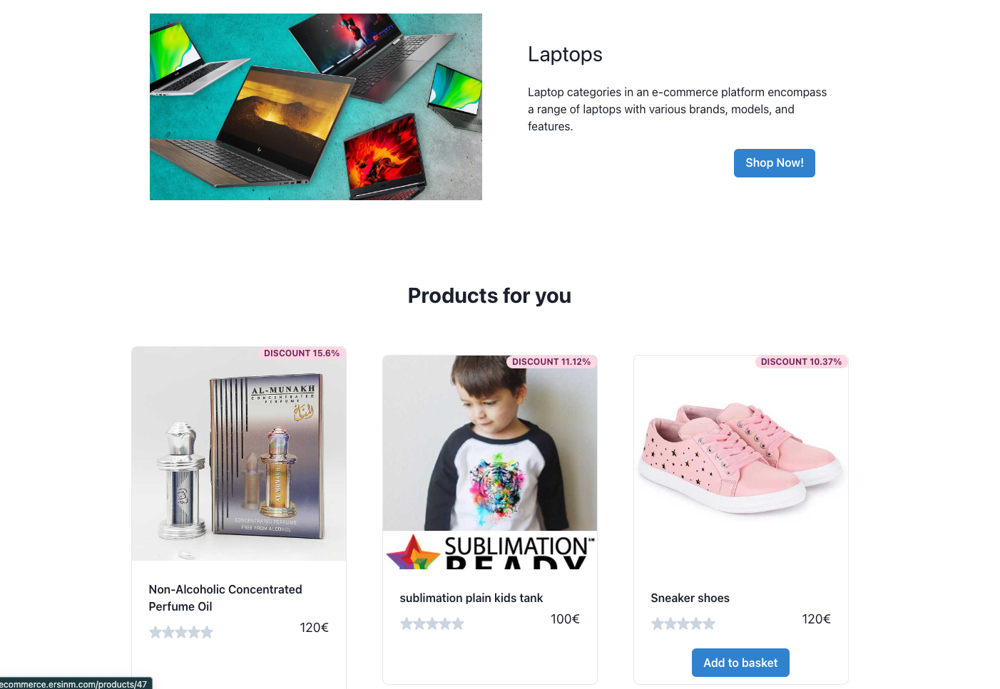
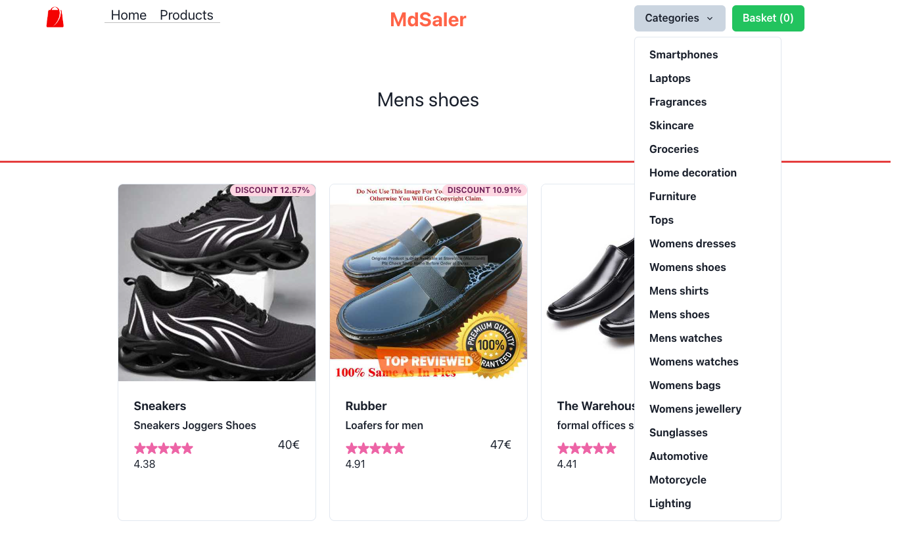
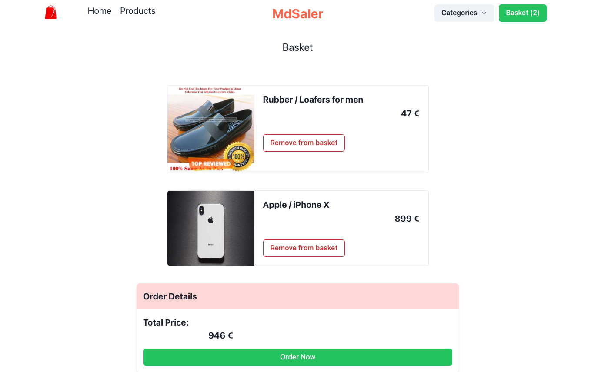

# eCommerce Portfolio Project with React

## Description

This is a website for a dummy ecommerce website for my portfolio.

It is built with React, React Router, React Query and Chakra UI. It is a single page application with a cart and checkout page. Sort items on category, add to basket and checkout. The checkout page is a dummy page with no payment gateway.

## Table of Contents

- [Installation](#installation)
- [Usage](#usage)
- [Credits](#credits)
- [License](#license)
- [Live Site](#live-site)
- [Screenshots](#screenshots)

## Installation

To install the necessary dependencies, run the following command:

1. Clone the repo
2. Run `npm install` to install dependencies
3. Run `npm start` to start the server

## Usage

1. Run `npm start` to start the server
2. Open [http://localhost:3000](http://localhost:3000) to view it in the browser.

## Credits

- [React](https://reactjs.org/)
- [React Router](https://reactrouter.com/)
- [React Query](https://react-query.tanstack.com/)
- [Chakra UI](https://chakra-ui.com/)

## License

MIT License

## Live Site

[Live Site](https://ecommerce.ersinm.com/)

## Screenshots

